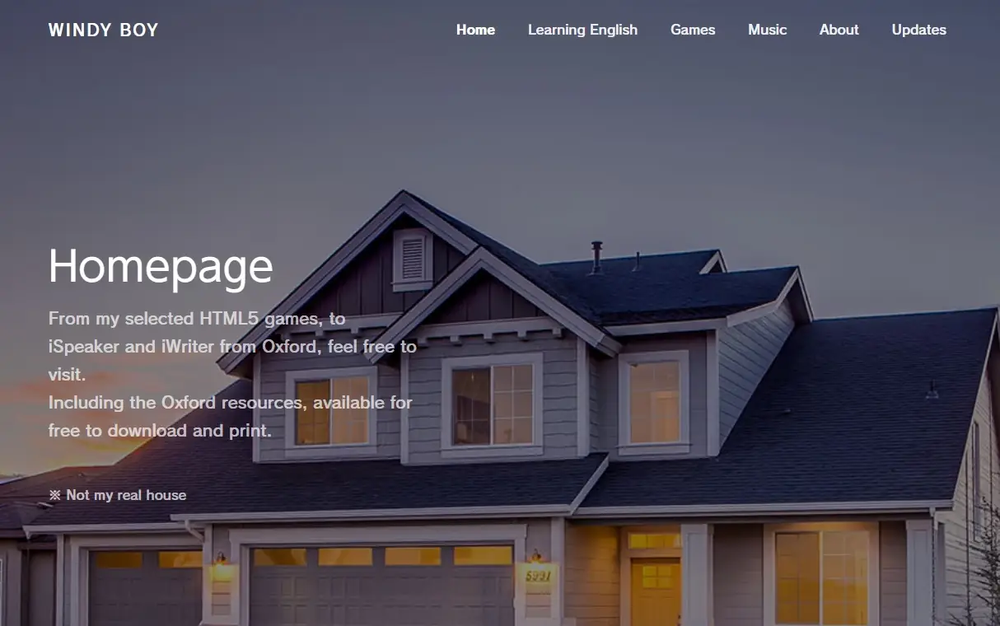
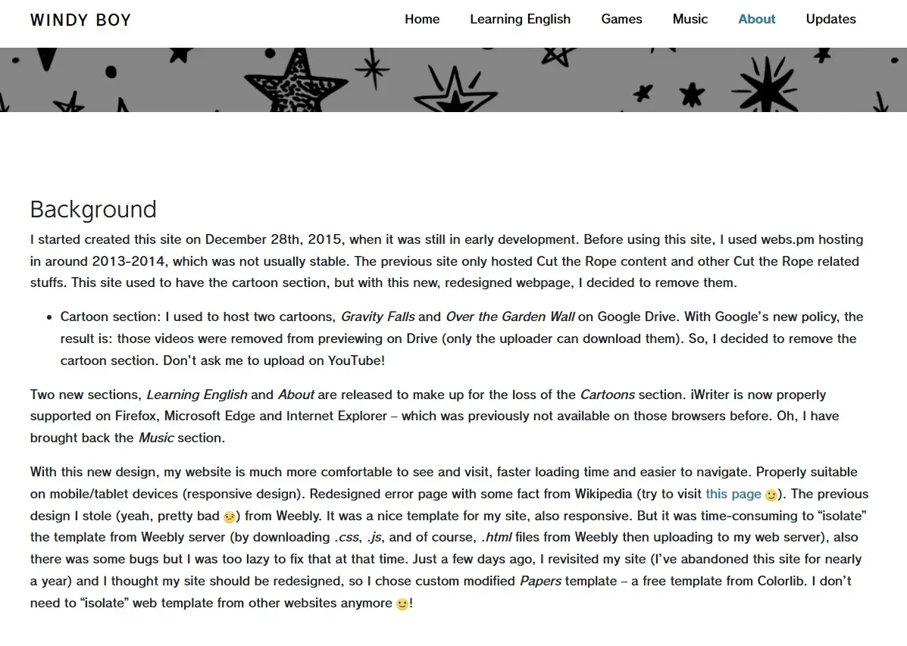
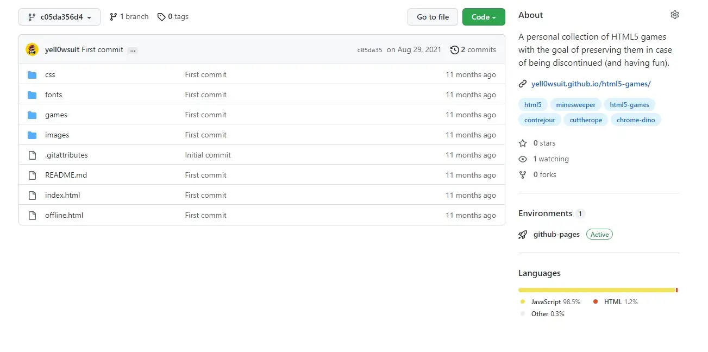
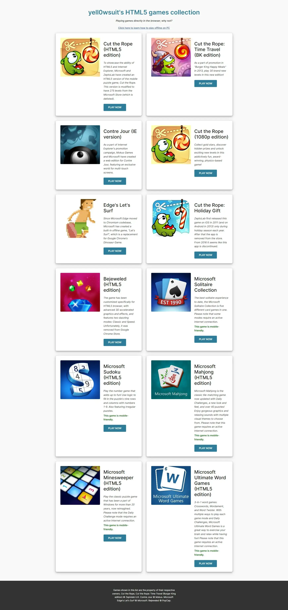

HTML5 games are interesting, and they can be played in the browser without installing. As far as I can remember, HTML5 tech grew in popularity (although minor) around 2012, when Microsoft partnered with some companies to bring their hit IPs to HTML5. _Cut the Rope_ was among the games that got ported to HTML5, and it was the reason why I was interested in HTML5.

<!--truncate-->

I first created a website way back in 2013. The first one was 000webhost, but it offered too little storage. Then host.lc (defunct), it offered unlimited free storage. The third website is the one in the image above (Windy Boy was my old nickname), it was made in 2015 and is still up. However, my interest for HTML5 games died down in late 2018 because I was busy with my study.

Then in 2021, I started having an interest in HTML5 games again. This time, I used GitHub Pages because I was broke. Revamped my site so it's cleaner than ever.

This was how my website on GitHub looked like originally (I used Nicepage template back then). It started out with only 12 games. MS Sudoku was the most tedious to get it working, because it has over 15k files for the puzzles. Getting the website working on mobile screens was difficult too because I had to manually tweak the CSS.

As my site continues to grow, a lot of things were changed, like adding game count, game save data download, etc. It also motivated me to learn [Bootstrap](https://getbootstrap.com/) instead of relying on pre-made template, and thanks to that, making my website has never been easier.
