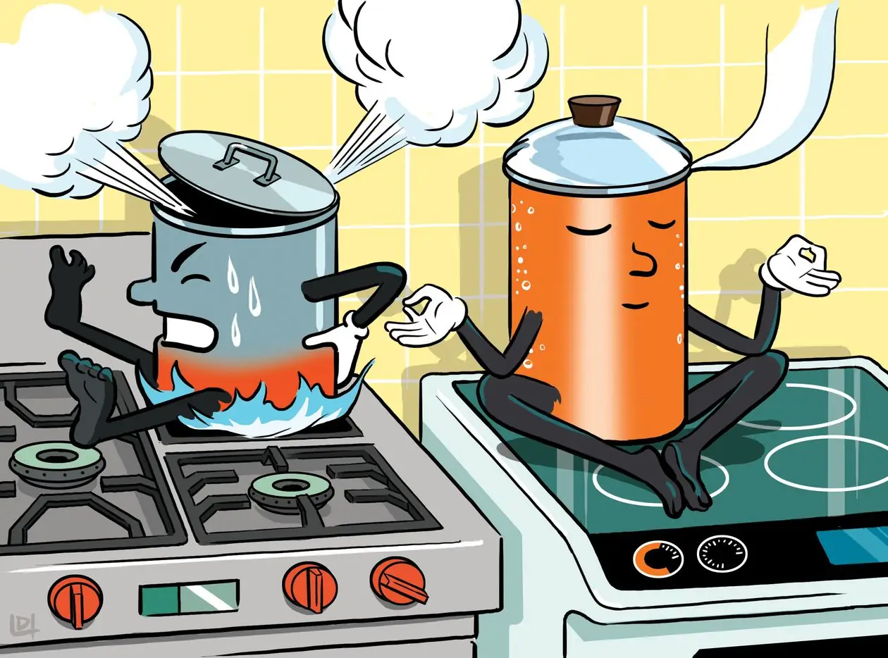

:::info

The content below may be outdated and does not reflect the current state of the website. It is included here as-is for archival purposes.

:::

The last few days I accidentally deleted an important file that helps the game run, so everyone experienced softlock at the game’s loading screen. This was fixed, and I really apologize for that.

But, to compensate that, I have added 5 new World Tour themes! Previously I added them, but some of them exhibited issues so I had to remove them quickly. I spent some time fixing them and finally they got fixed!

And I forgot that I have a blog, so if you have any issues with any of the games, don’t hesitate to comment here!
