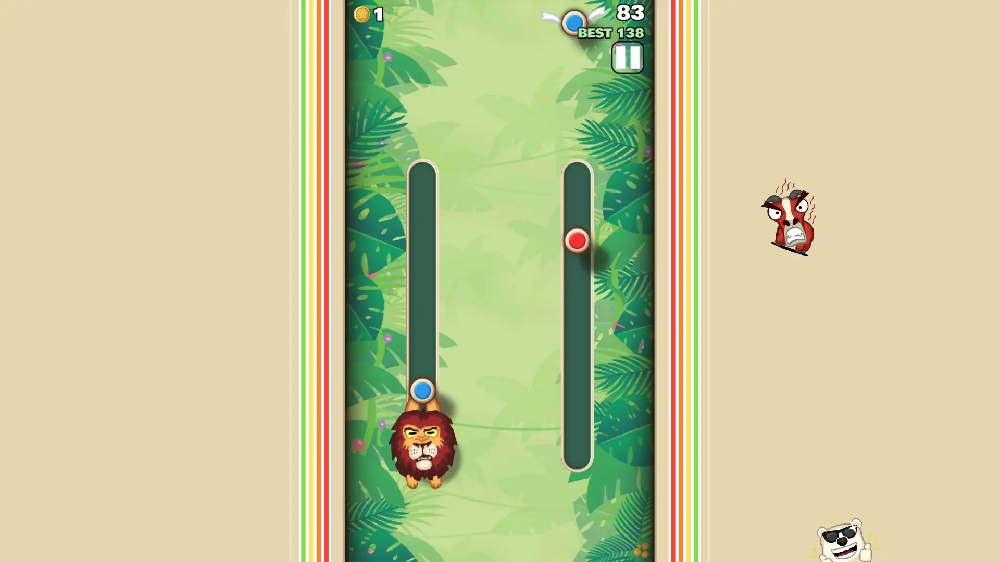
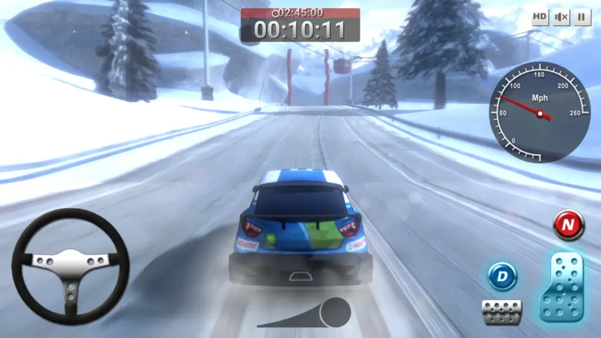

Two new games added this February: Sling Kong and Rally Point!

<!--truncate-->

---

## Game #1: Sling Kong

- **Developer(s)**: Protostar
- **Release year**: 2015

In this endless arcade game, you need to sling, bounce and swing your character up high (similar to Doodle Jump) to get the highest score while avoiding traps and obstacles. There are many characters for you to customize.

---

## Game #2: Rally Point

- **Developer(s)**: XformGames
- **Release year**: 2009

Beat the timer to win the courses. Use your nitro to boost around corners, but if you push it too far you'll EXPLODE!
