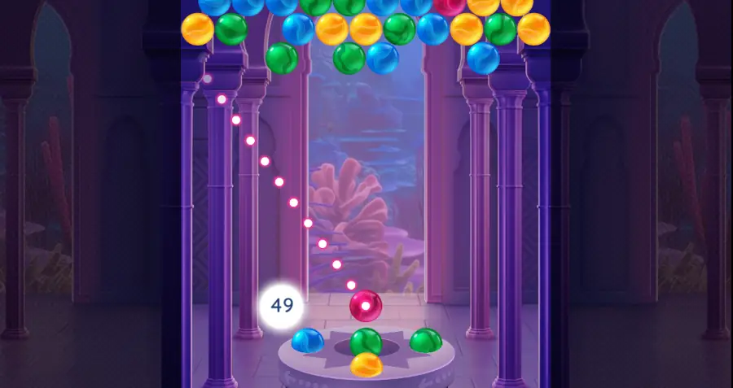
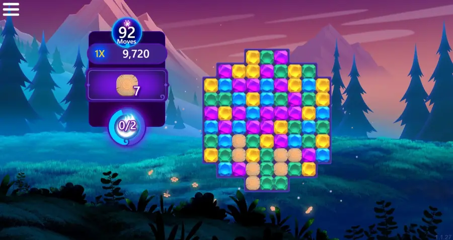
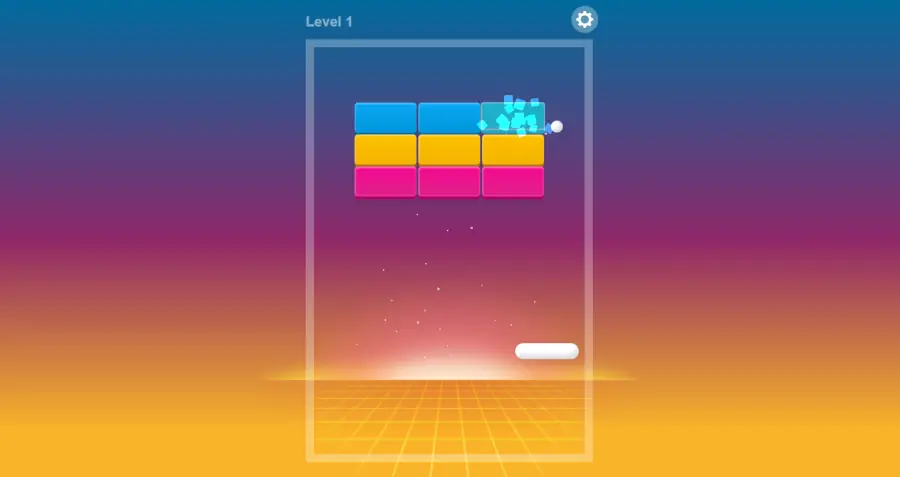

It's been a while since the last post! Three new games are added this June: Microsoft Bubble 2, Microsoft Gem Drop and Breakoid.

<!--truncate-->

---

## Game #1: Microsoft Bubble 2

- **Developer(s)**: Microsoft
- **Release year**: 2023

Get right to the FUN in Microsoft Bubble! Aim the Bubble launcher to match 3 or more of the same bubble color. Release the launcher and send your bubble to pop the matching bunch off the board! This is a brand new game with endless level which is different from Microsoft Bubble 1 (or Classic).

---

## Game #2: Microsoft Gem Drop

- **Developer(s)**: Microsoft
- **Release year**: 2023

Enjoy 40 levels of replayable gem dropping fun in a classic color-match puzzle game with a twist. Remove clusters of matching gems to clear the board, complete missions, and earn massive scores before running out of moves. Complete levels quickly, or test your gem dropping skills to increase your number of moves and maximze your score to reach the millions, or even billions!

---

## Game #3: Breakoid

- **Developer(s)**: supernice.games
- **Release year**: 2022

Break all the blocks - but it never stops! How long can you keep on going? Try to beat the highscore!
