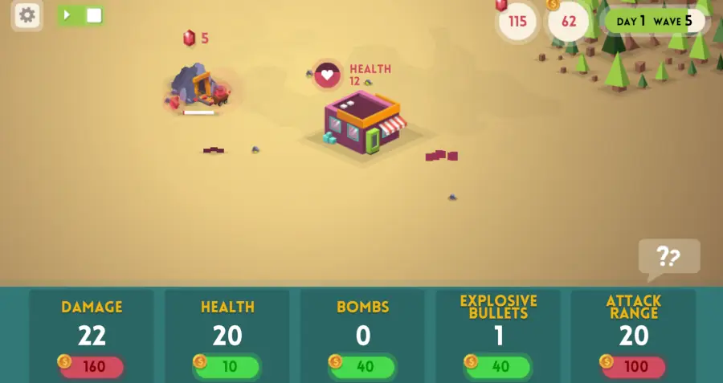
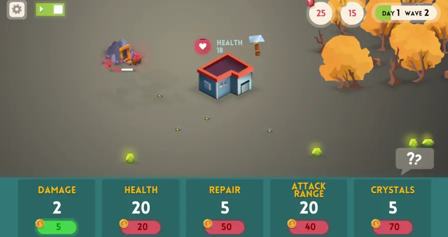
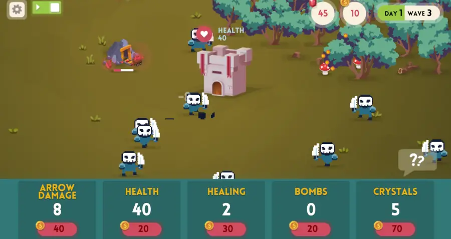

Three new games are added this July: Day of Meat, Day of Meat: Radiation and Day of Meat: Castle!

<!--truncate-->

---

## Game #1: Day of Meat

- Developer(s): Lampogolovii
- Release year: 2023

You are stuck in the shelter and seems like no way out. Help will come in three day, not earlier. Figure out how you can survive all these days. Start the game, play and die. Spend money earned for upgrades and try to get better result. Get crystals and gold and use them wisely if you want to live.

---

## Game #2: Day of Meat: Radiation

- Developer(s): Lampogolovii
- Release year: 2023

After a horrific disaster ravaged Earth, radioactive animals began to wreak havoc. It is up to you to protect yourself and your base from the terrifying monsters that attack you.

---

## Game #3: Day of Meat: Castle

- Developer(s): Lampogolovii
- Release year: 2023

Your kingdom has come under attack from an unknown enemy and your castle is the last bastion of defense! Take control of the castles defensive capabilities to keep these invaders away!
