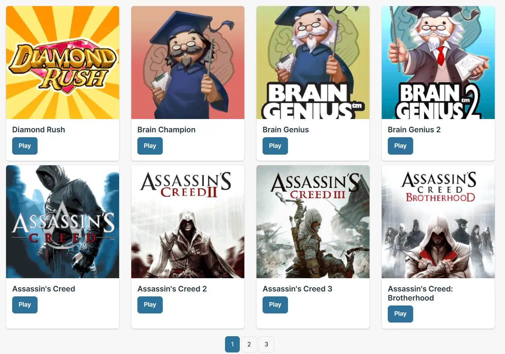

Before smartphones are the norm as of today, there was once a period where cellphones were popular. A lot of games were developed for those phones too, mainly from Nokia and Gameloft. Those games were written in Java, but for mobile formats, hence the name "ME" (Micro Edition).

<!--truncate-->

The project was forked from https://github.com/Rosabis/J2meJS, which in turn forked from [Mozilla's Pluotsorbet](https://github.com/mozilla/pluotsorbet). This was once a project that allows J2ME games to be run on web browsers. Unfortunately, the project was no longer maintained, and due to the complexity of the code, it's unlikely it will receive updates or patches to fix the graphical problems (unless some enthusiasts find it and decide to do so). The emulator isn't perfect for playing 3D games or games that show native menu, so there's that.

Regardless, for 2D games, it's (perfectly) capable. Currently, the collection has 24 games, but more games will be added over time once I have tested them. You can also upload your own JAR file to play too. Moreover, you can also download or import the game save\* to keep your progress.

\*J2ME game save is separated from HTML5 game save due to different code base.

On touch screens, for iOS unfortunately the emulator is frustrating to use due to the dumb "double tap to zoom" feature which makes it hard to repeatedly press the virtual keys. I do not have an Android device, so I don't know how the emulator experience on that, but if you have one, do test it and comment here about the experience.
