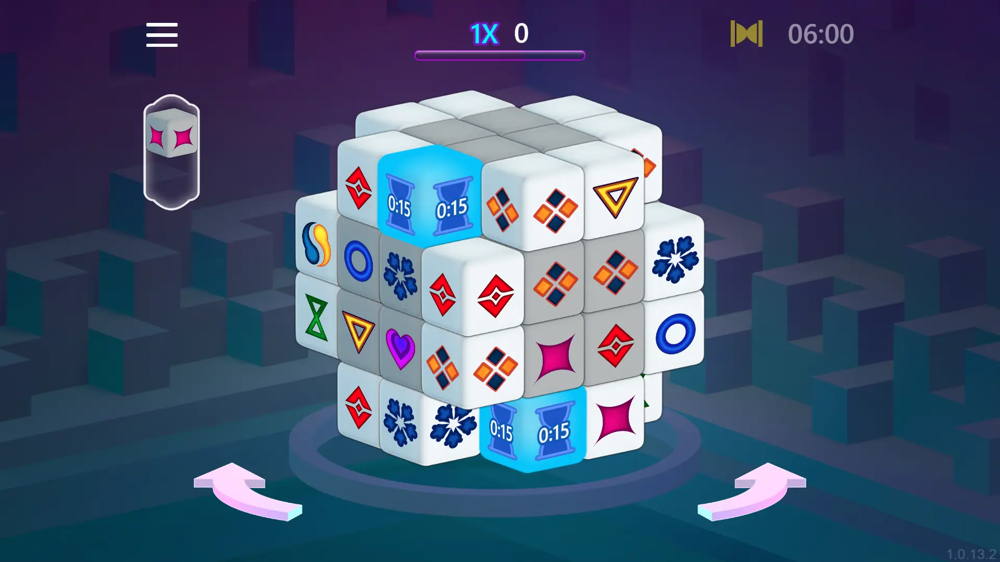
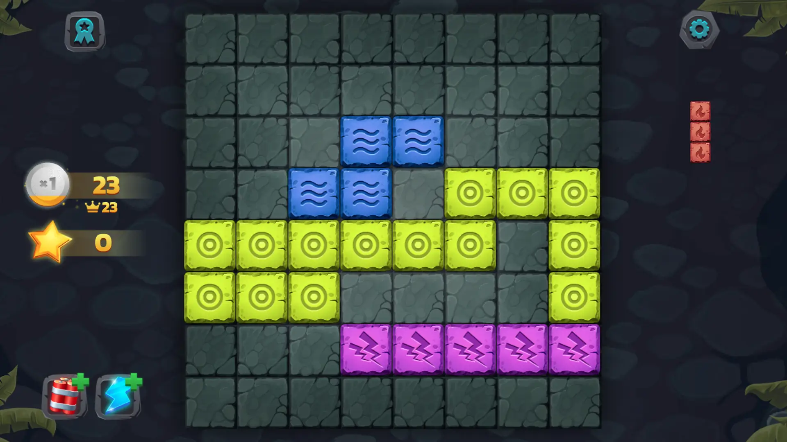
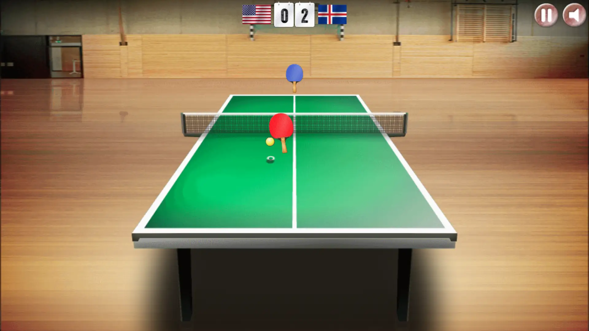
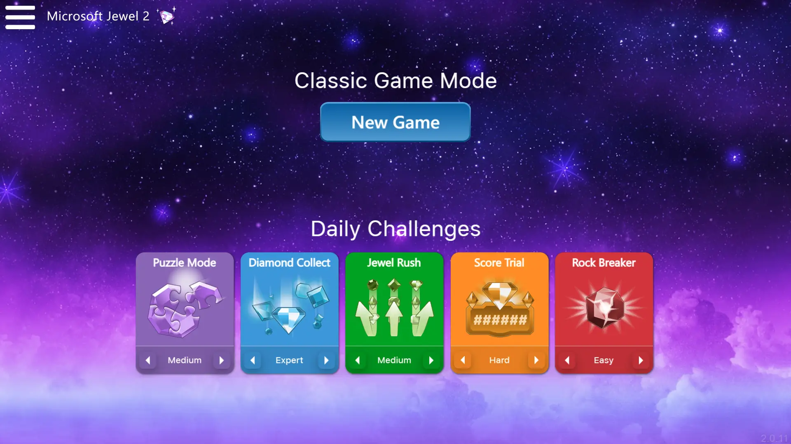
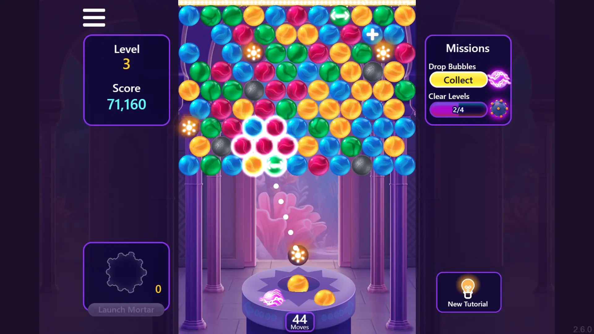

Well, it's been a while since I last added new games. But I got good news for you guys in late New Year 2024! Besides adding new and updated games, I have also tweaked and overhauled some part of the code to make it more robust while adding new features--including popular, new and updated badges.

<!--truncate-->

## What's added

**Game #1:** Microsoft Mahjong 3D **Developer(s):** Microsoft, Arkadium **Release year:** 2023

Twist and turn your way in a 3-dimensional Mahjong board to find matching symbols and earn massive scores. Complete pairs quickly to achieve BIG multipliers and clear all cubes before time runs out.

**Game #2:** Element Blocks **Developer(s):** Famobi **Release year:** 2019

Weather the elements in this crazy addictive puzzle game! Simply drag and drop the block shapes onto the grid in order to create vertical or horizontal lines and score as many points as possible. Only full lines will be destroyed, so plan ahead and keep an eye on the available pieces. The game is over if there's no space left on the grid to place a block. Collect stars to buy power ups, complete achievements and try to remove several lines at once to earn additional points!

**Game #3:** Table Tennis World Tour **Developer(s):** Famobi **Release year:** 2022

Table Tennis World Tour is a brilliant sports game in which you can try out your table tennis skills against a range of AI opponents. You can choose which nation you play for and then start competing in the global competition! To control your table tennis bat you simply move your mouse – the mouse emulates the movement of your hand so you can control the speed and spin of your shots with great accuracy.

---

## What's updated

**Game #1:** Microsoft Jewel 2 **Developer(s):** Microsoft, Arkadium

What's new: Added the Daily Challenges mode where you can play different modes every day. The game name is changed from "Microsoft Jewel Plus" to "Microsoft Jewel 2".

**Game #2:** Microsoft Bubble 2 **Developer(s):** Microsoft, Arkadium

What's new: Added new powerups and challenges to earn perks, along with new twists to the gameplay. Check the Help for more information.
