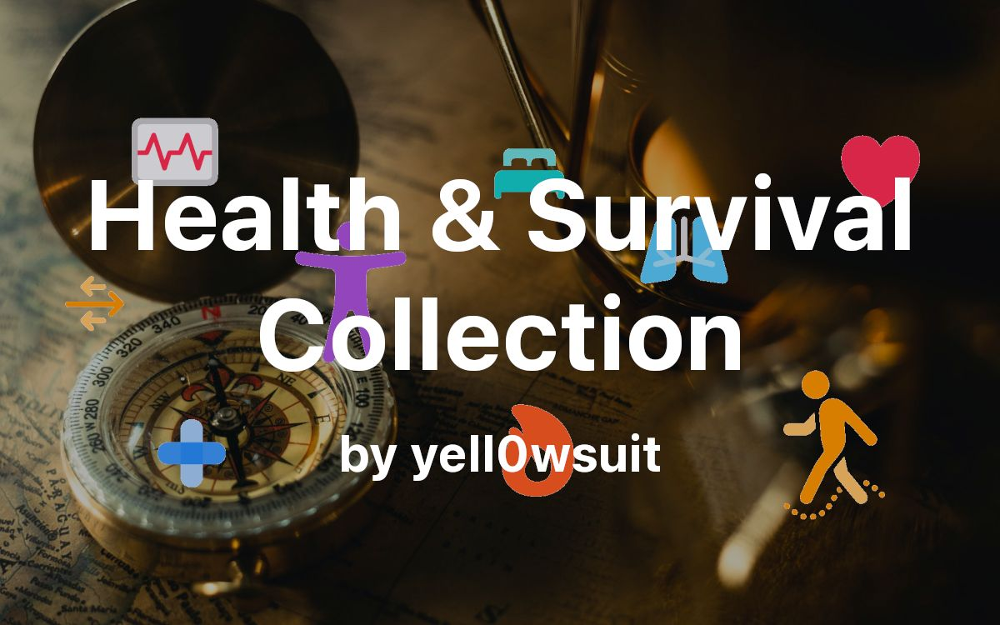

Today, I'm pleased to announce a new section - **_Health and Survival_**. It's a place where you can find **useful tips and resources** on how to **stay healthy and safe** in various situations.

<!--truncate-->

Health is **one of the most important** aspects of life. It **affects everything** we do, from simple tasks like breathing or walking, to more complex ones like playing sports or making decisions. Having **good health** is **not only a physical** condition, but also a **mental and emotional** state. And having **good health helps us survive**. But survival is **not just about avoiding accidents**, it is also about **living well and enjoying life**.

I started this project two years ago in private because I wanted it to be in a completed and polished state, but I never had the chance to finish it. I was busy with other things, and I had trouble finding a suitable solution to host the content. I tried different options, such as [WordPress](https://wordpress.org/), [Obsidian Publish](https://obsidian.md/publish), and [Jacky Zhao's Quartz](https://github.com/jackyzha0/quartz).

I first used WordPress, but now I found it unnecessary complex (HTML and stuff). For Obsidian Publish, it costs \$8/month, so I looked into Jacky Zhao's Quartz instead. But then later on, I didn't find it satisfying. Finally, I decided to use [Docusaurus](https://docusaurus.io/), which is a simple and elegant solution for creating this page. I like how it looks and how easy it is to use.

In this site, I have collections of health and survival tips from many sources. Here are some of them:

- SAS Survival Guide
- SAS Urban Survival Guide
- Apple Health articles

And of course, there will be more sources too. My goal is to build a collection of health and survival tips all conveniently in one place.

Also good news: the Health and Survival section is open source on GitHub: https://github.com/yell0wsuit/health-survival-docusaurus
